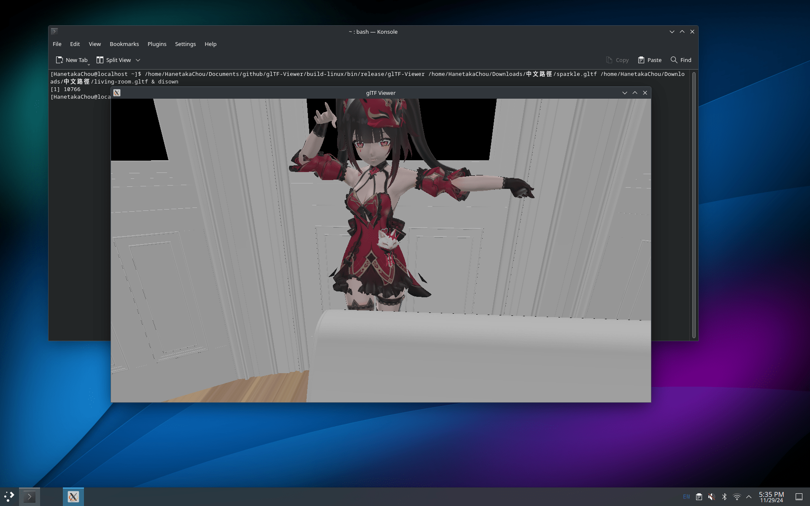

## Brioche Asset Import  

  

[Khronos ANARI (Analytic Rendering Interface): glTF To ANARI](https://github.com/KhronosGroup/ANARI-SDK/blob/next_release/src/anari_test_scenes/scenes/file/gltf2anari.h)  

- [x] Scene  
  - [x] glTF  
- [ ] Mesh
  - [ ] PMX 
- [ ] Animation 
  - [ ] VMD  
- [x] Image  
  - [x] DDS  
  - [x] PVR  
  - [ ] PNG  
  - [ ] JPEG  

  
